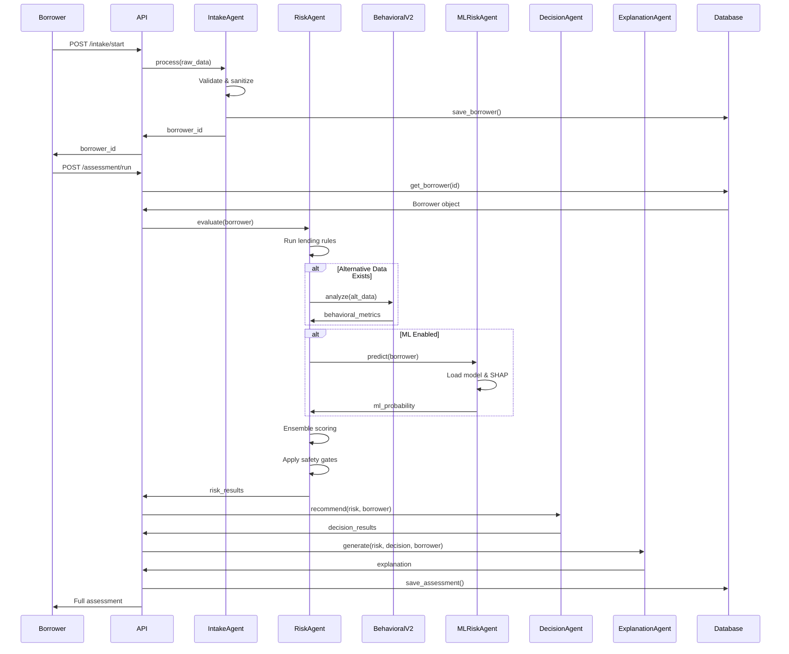

# Architecture Guide

This document provides a comprehensive overview of the Loan Officer AI Agent's system architecture, design patterns, and technical implementation.

## Table of Contents

- [System Overview](#system-overview)
- [Multi-Agent Architecture](#multi-agent-architecture)
- [Data Flow](#data-flow)
- [Database Schema](#database-schema)
- [Security Architecture](#security-architecture)
- [Feature Flag System](#feature-flag-system)
- [ML Ensemble Architecture](#ml-ensemble-architecture)
- [Scalability Considerations](#scalability-considerations)

---

## System Overview

The Loan Officer AI Agent is a **FastAPI-based microservice** that combines rule-based lending logic with optional ML predictions to provide credit risk assessments for microfinance institutions.

### Core Principles

1. **Safety First**: Rules always override ML predictions
2. **Explainability**: Every decision is fully auditable and explainable
3. **Multi-Tenancy**: Isolated data per organization
4. **Modular Design**: Each agent has a single, well-defined responsibility
5. **Feature Flags**: Gradual rollout of ML and behavioral features

### Technology Stack

- **Framework**: FastAPI (Python 3.9+)
- **Database**: Firebase Firestore (with in-memory fallback)
- **ML**: XGBoost + SHAP for explainability
- **Authentication**: JWT tokens + API keys with bcrypt hashing
- **Frontend**: React (optional dashboard)
- **Deployment**: Docker, cloud-agnostic

---

## Multi-Agent Architecture

The system uses a **multi-agent pattern** where each agent has a specific responsibility in the loan decision pipeline.

### Architecture Diagram

```
┌─────────────────────────────────────────────────────────────┐
│                      FastAPI REST API                        │
│                  (main.py - Routes & Middleware)             │
└──────────────────────┬──────────────────────────────────────┘
                       │
       ┌───────────────┼───────────────────┐
       │               │                   │
  ┌────▼────┐     ┌────▼────┐        ┌────▼────┐
  │ Intake  │     │  Risk   │        │Decision │
  │ Agent   │────▶│ Agent   │───────▶│ Agent   │
  └─────────┘     └────┬────┘        └────┬────┘
                       │                   │
       ┌───────────────┼───────────────┐   │
       │               │               │   │
  ┌────▼────┐    ┌────▼────┐    ┌────▼───▼────┐
  │Behavioral│    │   ML    │    │ Explanation │
  │Agent V2  │    │  Risk   │    │   Agent     │
  └──────────┘    │ Agent   │    └─────────────┘
                  └────┬────┘
                       │
              ┌────────▼────────┐
              │ Ensemble Engine │
              │ (Rule Override) │
              └─────────────────┘
                       
         ┌─────────────┴─────────────┐
         │                           │
    ┌────▼────┐                 ┌────▼────┐
    │  Audit  │                 │  Auth   │
    │  Agent  │                 │  Agent  │
    └─────────┘                 └─────────┘
```

### Agent Responsibilities

#### 1. IntakeAgent
**Purpose**: Data collection and validation

- Validates borrower input data
- Sanitizes phone numbers and emails
- Creates Borrower objects from raw input
- **Input**: Raw JSON from borrower portal
- **Output**: Validated `Borrower` object

**Key Functions:**
```python
IntakeAgent.process(raw_data: dict) -> Borrower
```

---

#### 2. RiskAgent
**Purpose**: Core risk orchestrator

- Runs deterministic lending rules
- Calls BehavioralAgentV2 if alternative data exists
- Calls MLRiskAgent if ML is enabled
- Combines rule + ML scores with safety gates
- Applies hard overrides for critical violations

**Input**: `Borrower` object
**Output**: Risk results dictionary with:
- `risk_score` (0-100)
- `risk_level` (LOW/MEDIUM/HIGH)
- `flags` (list of risk flags)
- `metrics` (DTI, affordability, ML probability, etc.)

**Key Functions:**
```python
RiskAgent.evaluate(borrower: Borrower) -> dict
```

**Safety Gates:**
1. Critical flags force `risk_score = 100`
2. ML cannot reduce rule-based score
3. Ensemble weighting respects `RULE_WEIGHT` and `ML_WEIGHT`

---

#### 3. BehavioralAgentV2
**Purpose**: Alternative data analysis (without ML)

Analyzes transaction history to extract behavioral signals:
- **Income Consistency**: Coefficient of variation of deposits
- **Transaction Stability**: Inverse of spending volatility
- **Savings Behavior**: Net cash flow trends
- **Utility Compliance**: On-time payment percentage
- **Early Warnings**: Spending spikes, missed payments

**Input**: `AlternativeData` object
**Output**: Behavioral metrics dictionary

**Key Functions:**
```python
BehavioralAgentV2.analyze(alt_data: AlternativeData) -> dict
BehavioralAgentV2.analyze_transactions(transactions: List[Transaction]) -> dict
```

---

#### 4. MLRiskAgent
**Purpose**: Predictive ML scoring

- Loads XGBoost model from disk
- Generates probability of default predictions
- Computes SHAP feature importance for explainability
- **Fallback**: Returns None if model unavailable

**Input**: `Borrower` object
**Output**: Dictionary with:
- `ml_probability` (0.0-1.0)
- `ml_confidence` (0.0-1.0)
- `feature_importance` (SHAP values)

**Key Functions:**
```python
MLRiskAgent.predict(borrower: Borrower) -> dict
```

---

#### 5. DecisionAgent
**Purpose**: Loan recommendation logic

Translates risk scores into business decisions:
- **LOW risk (0-40)**: APPROVED at base rate (15%)
- **MEDIUM risk (41-70)**: CONDITIONAL_APPROVAL at higher rate (20%)
- **HIGH risk (71-100)**: REJECT

**Input**: Risk results + Borrower
**Output**: Decision dictionary with:
- `decision` (APPROVED/CONDITIONAL_APPROVAL/REJECT)
- `recommended_amount`
- `recommended_interest_rate`

**Key Functions:**
```python
DecisionAgent.recommend(risk_results: dict, borrower: Borrower) -> dict
```

---

#### 6. ExplanationAgent
**Purpose**: Transparent, structured explanations

Generates human-readable explanations with:
- **Executive Summary**: One-sentence decision summary
- **Risk Assessment**: Key risk factors identified
- **Behavioral Insights**: Alternative data findings (if available)
- **ML Insights**: Feature importance (if ML enabled)
- **Officer Guidance**: Next steps and recommendations

**Input**: Risk results + Decision + Borrower
**Output**: Structured explanation dictionary

**Key Functions:**
```python
ExplanationAgent.generate(risk_results, decision_results, borrower) -> dict
```

---

#### 7. AuditAgent
**Purpose**: Event logging for compliance

- Logs all system events (intake, assessment, disbursement)
- Stores to Firestore with timestamps
- Supports organization-scoped queries
- **Critical for**: Regulatory compliance, debugging, analytics

**Key Functions:**
```python
AuditAgent.log_event(event_type: str, actor: str, metadata: dict)
AuditAgent.list_org_logs(org_id: str, limit: int) -> List[dict]
```

---

#### 8. AuthAgent
**Purpose**: Authentication and authorization

- JWT token generation and validation
- API key hashing and verification
- User authentication
- Role-based access control (OFFICER, ORG_ADMIN, SUPER_ADMIN)

**Key Functions:**
```python
AuthAgent.authenticate_user(email, password) -> User
AuthAgent.create_access_token(data: dict) -> str
AuthAgent.create_api_key(org_id, name, env) -> (str, APIKey)
AuthAgent.get_current_user(token) -> User
AuthAgent.get_api_key(api_key) -> AuthUser
```

---

#### 9. SelfHealingAgent
**Purpose**: Continuous learning feedback loop

- Registers loan outcomes (PAID/DEFAULTED)
- Tracks prediction accuracy
- Triggers model retraining when accuracy degrades
- **Future**: Auto-tuning of ensemble weights

**Key Functions:**
```python
SelfHealingAgent.register_outcome(loan_id, status)
SelfHealingAgent.check_model_drift() -> bool
```

---

## Data Flow

### Complete Assessment Flow



---

## Database Schema

### Firestore Collections

#### `borrowers` Collection

```python
{
  "id": "BOR-A1B2C3D4",
  "name": "Jane Doe",
  "phone": "+254700000000",
  "email": "jane@example.com",
  "employment_type": "trader",
  "monthly_income": 50000,
  "monthly_expenses": 20000,
  "existing_debt": 5000,
  "loan_amount_requested": 15000,
  "loan_purpose": "Business stock expansion",
  "organization_id": "ORG-12345",
  "created_at": "2024-01-15T10:30:00Z"
}
```

#### `assessments` Collection

```python
{
  "assessment_id": "ASMT-X1Y2Z3A4",
  "borrower_id": "BOR-A1B2C3D4",
  "organization_id": "ORG-12345",
  "risk_score": 45,
  "risk_level": "MEDIUM",
  "decision": "CONDITIONAL_APPROVAL",
  "recommended_amount": 15000,
  "recommended_interest_rate": 20.0,
  "requested_amount": 15000,
  "explanation": {...},
  "flags": [...],
  "metrics": {...},
  "created_at": "2024-01-15T10:35:00Z"
}
```

#### `loans` Collection

```python
{
  "loan_id": "LOAN-B5C6D7E8",
  "assessment_id": "ASMT-X1Y2Z3A4",
  "borrower_id": "BOR-A1B2C3D4",
  "organization_id": "ORG-12345",
  "amount": 15000,
  "interest_rate": 20.0,
  "status": "ACTIVE",  # ACTIVE, PAID, DEFAULTED, WRITTEN_OFF
  "disbursed_at": "2024-01-15T11:00:00Z",
  "closed_at": null
}
```

#### `alternative_data` Collection

```python
{
  "borrower_id": "BOR-A1B2C3D4",
  "mobile_money_history": [
    {
      "timestamp": "2024-01-15T10:30:00Z",
      "type": "DEPOSIT",
      "amount": 5000,
      "counterparty": "Salary"
    }
  ],
  "utility_history": [
    {
      "month": "2024-01",
      "type": "ELECTRICITY",
      "amount_due": 500,
      "amount_paid": 500,
      "paid_on_time": true
    }
  ],
  "airtime_usage_avg": 500
}
```

#### `organizations` Collection

```python
{
  "id": "ORG-12345",
  "name": "Example MFI",
  "webhook_url": "https://example.com/webhooks",
  "webhook_secret": "whsec_abc123",
  "feature_flags": {
    "enable_ml": true,
    "enable_behavioral": true
  },
  "created_at": "2024-01-01T00:00:00Z"
}
```

#### `users` Collection

```python
{
  "id": "USER-123",
  "email": "officer@example.com",
  "password_hash": "$2b$12$...",
  "role": "OFFICER",  # OFFICER, ORG_ADMIN, DEVELOPER, SUPER_ADMIN
  "organization_id": "ORG-12345",
  "created_at": "2024-01-01T00:00:00Z"
}
```

#### `api_keys` Collection

```python
{
  "key_hash": "sha256_hash_of_key",
  "key_prefix": "loa_live_abc1",
  "name": "Production API Key",
  "environment": "production",  # production, development, test
  "organization_id": "ORG-12345",
  "role": "OFFICER",
  "status": "ACTIVE",  # ACTIVE, REVOKED
  "created_by": "USER-123",
  "created_at": "2024-01-01T00:00:00Z"
}
```

#### `audit_logs` Collection

```python
{
  "event_type": "ASSESSMENT_GENERATE",
  "actor": "SYSTEM",
  "organization_id": "ORG-12345",
  "timestamp": "2024-01-15T10:35:00Z",
  "metadata": {
    "assessment_id": "ASMT-X1Y2Z3A4",
    "borrower_id": "BOR-A1B2C3D4"
  }
}
```

---

## Security Architecture

### Multi-Tenancy Isolation

Every data model includes `organization_id` to ensure tenant isolation:

```python
# All queries are scoped by organization
Database.list_assessments(organization_id="ORG-12345")
Database.get_borrower(borrower_id, organization_id="ORG-12345")
```

**Enforcement Points:**
1. API endpoints verify `organization_id` matches authenticated user
2. Database queries filter by `organization_id`
3. Cross-org access attempts logged to audit trail

---

### Authentication Methods

#### 1. JWT Tokens (Dashboard Users)

- **Use Case**: Web dashboard, user-based authentication
- **Storage**: httpOnly cookies or localStorage
- **Expiration**: 30 minutes (configurable)
- **Payload**: `{sub: email, role: OFFICER, org: ORG-12345}`

**Security Measures:**
- bcrypt password hashing (cost factor 12)
- HS256 signing algorithm
- Short expiration times
- Refresh token rotation (future)

---

#### 2. API Keys (M2M Communication)

- **Use Case**: Backend integrations, mobile apps
- **Format**: `loa_{env}_{random}`
  - `loa_live_abc123...` (production)
  - `loa_test_xyz789...` (test)
- **Storage**: SHA-256 hashed, only prefix stored in plaintext

**Security Measures:**
- API keys shown only once at creation
- Revocable at any time
- Scoped by organization and role
- Rate limiting per key (recommended)

---

### Data Encryption

- **At Rest**: Firestore encrypts all data by default
- **In Transit**: HTTPS/TLS 1.2+ required for all API calls
- **Sensitive Fields**: Password hashes use bcrypt
- **Secrets**: Webhook secrets prefixed with `whsec_`

---

## Feature Flag System

Feature flags allow gradual rollout of AI capabilities without code changes.

### Configuration (`config.py`)

```python
# Feature Flags
ENABLE_ML_RISK_SCORING = os.getenv("ENABLE_ML_RISK_SCORING", "true").lower() == "true"
ENABLE_BEHAVIORAL_V2 = os.getenv("ENABLE_BEHAVIORAL_V2", "true").lower() == "true"
ENABLE_LLM_EXPLANATIONS = os.getenv("ENABLE_LLM_EXPLANATIONS", "false").lower() == "true"
```

### Runtime Updates

```python
# SUPER_ADMIN can update flags via API
POST /config/flags/update
{
  "flag_name": "ENABLE_ML_RISK_SCORING",
  "value": false
}
```

**Important**: Runtime changes are **not persisted**. Server restart reverts to environment variables.

### Deployment Strategy

**Phase 1: Rule-Only (Safest)**
```bash
ENABLE_ML_RISK_SCORING=false
ENABLE_BEHAVIORAL_V2=true
```

**Phase 2: Conservative ML**
```python
ENABLE_ML_RISK_SCORING=true
RULE_WEIGHT=0.8  # 80% rules
ML_WEIGHT=0.2    # 20% ML
```

**Phase 3: Balanced Production**
```python
RULE_WEIGHT=0.7  # 70% rules
ML_WEIGHT=0.3    # 30% ML
```

---

## ML Ensemble Architecture

### Ensemble Scoring Formula

```python
if ENABLE_ML_RISK_SCORING and ml_result:
    ensemble_score = (RULE_WEIGHT * rule_score) + (ML_WEIGHT * ml_probability * 100)
    
    # Safety Gate: ML cannot reduce rule score
    final_score = max(rule_score, ensemble_score)
else:
    final_score = rule_score
```

### Example Calculation

**Scenario**: Borrower with borderline profile
- `rule_score = 65` (MEDIUM risk)
- `ml_probability = 0.3` (30% default probability)
- `RULE_WEIGHT = 0.7`, `ML_WEIGHT = 0.3`

**Calculation**:
```
ensemble_score = (0.7 * 65) + (0.3 * 30) = 45.5 + 9 = 54.5
final_score = max(65, 54.5) = 65  # Rule score prevails
```

**Result**: Final score is 65 (MEDIUM), ensuring ML cannot be overly optimistic.

---

### SHAP Explainability

Every ML prediction includes SHAP feature importance:

```python
{
  "ml_probability": 0.3,
  "feature_importance": [
    {"feature": "monthly_income", "impact": 0.15},
    {"feature": "debt_to_income_ratio", "impact": -0.08},
    {"feature": "employment_type", "impact": 0.05}
  ]
}
```

---

## Scalability Considerations

### Current Architecture (V1)

- **Single server**: Suitable for <1000 requests/day
- **In-memory caching**: ML model loaded once at startup
- **Firestore**: Auto-scales reads/writes

### Scaling Path

**Horizontal Scaling**:
```bash
# Run multiple instances behind load balancer
uvicorn main:app --workers 4 --port 8000
```

**Caching**:
- Add Redis for session storage
- Cache ML model in shared memory
- Cache frequent assessment queries

**Database Optimization**:
- Add Firestore composite indexes for common queries
- Consider read replicas for analytics

**Async Processing**:
- Queue long-running tasks (model retraining) to Celery/RabbitMQ
- Webhook delivery via background workers

---

## Next Steps

- [Agent System Guide](./agents.md) - Deep dive into each agent
- [Integration Guide](./integration.md) - How to integrate with your app
- [Deployment Guide](./deployment.md) - Production deployment
